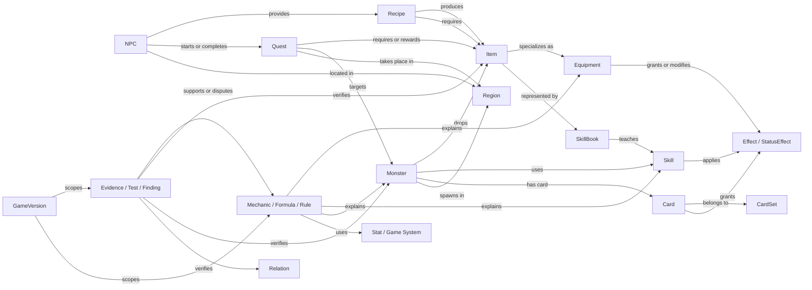

# 《放置天堂整合百科》最高層架構藍圖

## 1. 文件定位

本文件是《放置天堂整合百科》的最高層架構藍圖，定義專案長期的資料邊界、關聯原則、驗證標準與發展順序。後續的資料契約、Schema、生成器、Repository、搜尋、頁面與研究文件都應與本藍圖一致；若下層設計與本文件衝突，應先釐清並修訂架構文件，不應直接以 UI 或既有程式行為取代資料定義。

本文件不是實作規格，不指定檔名、函式、畫面元件或儲存技術，也不代表所有領域資料已完成或已驗證。

### 1.1 專案定位

本專案同時具有兩個互補定位：

1. **Game Database（遊戲資料庫）**：以穩定 ID 描述遊戲中的 Entity、屬性、來源與跨模組關聯，讓使用者能從任一資料點追溯完整脈絡。
2. **Verified Mechanics Database（已驗證機制資料庫）**：記錄公式、隱藏效果、程式判定、測試證據與版本差異，明確區分已知事實、合理推論及尚未解決的問題。

最高目標不是堆積文字，而是建立一套可追溯、可驗證、可擴充、可交叉查詢的遊戲知識系統。

### 1.2 核心原則

- **ID-first**：正式關聯一律使用穩定 ID，不以中文名稱作為關聯鍵。
- **Entity ownership**：每種 Entity 只有一個權威資料領域；其他領域以 `EntityRef` 引用，不複製主資料。
- **Evidence before certainty**：沒有證據的欄位不得假裝已驗證；無法確認時保留 `unresolved`。
- **Facts and interpretation separated**：原始資料、推導結果、研究結論與 UI 文案分層保存。
- **Version-aware**：可能因遊戲版本改變的內容必須能指出適用版本或時間範圍。
- **Backward-compatible evolution**：資料模型演進應小步進行，保留驗證、fallback 與回歸基準。
- **Static-site compatible**：整體設計應維持可由靜態網站提供的特性，不預設需要後端服務。

## 2. Data Domains

Data Domain 是資料所有權與驗證責任的邊界，不等同於頁籤或檔案目錄。同一頁可以聚合多個 Domain，但不應模糊主資料來源。

| Domain | 核心 Entity | 責任範圍 | 主要跨域關聯 |
|---|---|---|---|
| Equipment | Equipment、EquipmentSet、EquipEffect | 武器、防具、飾品、裝備限制、能力與套裝效果 | Item、Skill、Monster、Recipe、Mechanics |
| Skill | Skill、SkillBook、SkillEffect | 主動／被動技能、消耗、目標、冷卻、狀態效果與技能書 | Item、Class、Monster、Mechanics |
| Monster | Monster、MonsterVariant、Spawn、Drop | 怪物能力、出現區域、行為、技能與掉落 | Region、Item、Card、Quest、Mechanics |
| Recipe | Recipe、Requirement、CraftOutput | 製作 NPC、產量、材料、金幣成本、特殊規則與配方樹 | Item、NPC、Quest、Drop |
| NPC | NPC、Shop、Exchange | NPC 身分、位置、功能、商店、交換與服務 | Region、Recipe、Quest、Item |
| Quest | Quest、QuestStep、QuestRequirement、QuestReward | 任務前置、步驟、目標、交付、獎勵與限制 | NPC、Monster、Item、Region、Class |
| Card | Card、CardSet、CardEffect | 卡片來源、稀有度、收集組合與能力效果 | Monster、Region、Mechanics |
| System | Class、Stat、StatusEffect、Currency、Region、GameVersion | 全域共享定義、列舉、單位、版本及基礎規則 | 所有 Domain |
| Mechanics | Mechanic、Formula、Rule、DerivedValue | 計算公式、觸發條件、優先序、隱藏效果與程式解析 | System 與所有戰鬥／數值 Entity |
| Research | Evidence、Observation、TestCase、Finding、VersionDiff | 證據、測試、程式來源、推論、衝突與版本差異 | 所有 Entity、Relation、Mechanic |

### 2.1 Domain 邊界規則

- `Item` 是可持有物件的共用身分；Equipment、SkillBook、Material 等是 Item 的分類或對應 Entity，不應各自創造互不相容的身分。
- Drop 描述「來源到 Item」的取得關係，不擁有 Monster 或 Item 主資料。
- Recipe 擁有配方規則，但不擁有 NPC 與 Item 的名稱、位置或能力。
- Mechanics 描述規則與推導，不取代 Equipment、Skill、Monster 的基礎欄位。
- Research 記錄「為什麼相信某個主張」，不直接成為遊戲數值的第二份主資料。
- System Domain 提供跨域共用語彙；未確認的共用 Entity 仍使用 stub 與 unresolved 狀態，不自行虛構 ID。

## 3. Entity Relationship

### 3.1 核心關聯圖



### 3.2 Entity 與 Relation 的分工

- **Entity** 表達可獨立識別的對象，例如 `monster`、`npc`、`recipe`、`skill`。
- **EntityRef** 是跨 Domain 的穩定引用，至少包含 `entityType` 與 `entityId`。
- **Relation** 表達兩個 Entity 之間具有語意、方向及來源的連結，例如「怪物掉落物品」或「技能套用狀態」。
- 多對多、具有屬性、需要證據或會隨版本變動的關聯，應視為一級 Relation，而不是只存 ID 陣列。
- Relation 應能表達方向、反向導覽、適用版本、驗證狀態與證據引用。
- 不完整的引用不得以名稱硬接；應保留原始文字、候選項與 unresolved 狀態。

### 3.3 典型 Relation 類型

| Relation | From | To | 可附加資訊 |
|---|---|---|---|
| `produces` | Recipe | Item | quantity、cost、variant |
| `requires` | Recipe／Quest | Item | quantity、consume、optional |
| `provided_by` | Recipe | NPC | location、availability |
| `drops` | Monster | Item | rate、condition、region、version |
| `teaches` | SkillBook | Skill | class、level、version |
| `uses_skill` | Monster | Skill | trigger、priority |
| `applies_effect` | Skill／Equipment／Card | Effect | magnitude、duration、stacking |
| `spawns_in` | Monster | Region | spawn rule、time、variant |
| `rewards` | Quest | Item／Currency | quantity、choice group |
| `supported_by` | Claim／Mechanic／Relation | Evidence | confidence、scope |

## 4. Game Systems

Game Systems 是跨 Entity 共用的規則語彙。系統欄位必須有定義、單位、作用階段與適用對象，避免同一縮寫在不同頁面有不同解釋。

### 4.1 Attributes 與 Combat Stats

| 系統 | 定義範圍 | 必須釐清的問題 |
|---|---|---|
| STR | 力量及其衍生近戰／負重效果 | 門檻、加成表、職業差異、版本差異 |
| DEX | 敏捷及其衍生命中、遠程、AC／ER 效果 | 套用順序、上限、武器條件 |
| INT | 智力及其衍生魔法傷害、命中、消耗效果 | 傷害公式、減免前後順序、技能例外 |
| CON／WIS／CHA | 體質、精神、魅力及其衍生系統 | 成長規則、召喚、抗性與資源影響 |
| AC | 物理防禦或閃避相關判定 | 顯示值與實際機率的對應 |
| MR | 魔法防禦／抗性判定 | 成功率、減傷、狀態抗性是否分離 |
| ER | 遠程迴避 | 判定時點、適用攻擊、上限與忽略效果 |
| DR | 傷害減免 | 固定／百分比、傷害類型、最低傷害 |
| Hit／Damage | 命中與傷害修正 | 攻擊類型、骰值、暴擊及元素套用順序 |
| HP／MP | 生命與魔力資源 | 回復、消耗、上限、死亡與重生規則 |

### 4.2 Buff、Debuff 與 StatusEffect

每個狀態效果應能描述：

- 效果分類：Buff、Debuff、Control、Damage over Time、Heal over Time、Aura 或 Passive。
- 來源與目標範圍。
- 數值、單位、持續時間與 tick 規則。
- 疊加方式：取最高、累加、刷新、獨立計時或互斥群組。
- 驅散、免疫、抗性與死亡後是否保留。
- 與其他效果的優先序及衝突規則。
- 顯示名稱與實際程式效果是否一致。

### 4.3 Combat Pipeline

戰鬥機制應以可驗證的階段描述，而不是只提供一條無上下文公式：

```text
Action eligibility
→ target selection
→ hit / avoidance check
→ base value construction
→ additive and multiplicative modifiers
→ defense / resistance / reduction
→ critical or special rule
→ minimum / maximum clamp
→ HP / MP / status application
→ on-hit / on-damage / on-kill triggers
→ cooldown, resource and log update
```

各階段是否存在、順序為何及例外條件，都必須由 Mechanics 與 Research Layer 記錄，不應僅由 UI 顯示推定。

### 4.4 其他共享系統

- 職業、等級、轉職與使用限制。
- 裝備欄位、雙手／單手、套裝與強化。
- 元素、抗性、屬性傷害與弱點。
- 掉落、稀有度、機率、保底與條件掉落。
- 製作產量、金幣、遞迴需求、循環與多配方歧義。
- 任務狀態、前置條件、分支與一次性獎勵。
- 卡片收集、套卡效果與重複卡規則。
- 寵物、召喚物、同伴及其繼承屬性。
- 離線收益、時間、冷卻及遊戲循環。

## 5. Mechanics Layer

Mechanics Layer 將「資料顯示」提升為「可解釋的遊戲規則」。它應能回答公式如何運作、何時適用、有哪些例外，以及結論從何而來。

### 5.1 核心物件

- **Mechanic**：一個可命名的規則主題，例如 ER 判定或製作產量換算。
- **Formula**：有輸入、輸出、單位、運算順序與邊界條件的計算定義。
- **Rule**：不一定是數學公式的條件式行為，例如技能互斥或死亡後移除 Buff。
- **Modifier**：由裝備、技能、卡片、狀態或職業提供的修正。
- **DerivedValue**：由基礎值及 Mechanic 推導、可重算且不應成為第二份來源的結果。
- **Claim**：對機制的單一可驗證陳述，可被 Evidence 支持、反駁或標記未解。

### 5.2 公式描述要求

每個 Formula 至少應說明：

- 穩定 ID、名稱與目的。
- 輸入值、來源 EntityRef、資料型別與單位。
- 計算階段、運算順序、取整方式與上下限。
- 適用攻擊／技能／職業／版本。
- 例外、未知參數及 unresolved 假設。
- 可重現範例與邊界測試。
- 支持此公式的 Evidence 與信心等級。

### 5.3 隱藏效果與程式解析

- 顯示文字與實際程式效果應分開記錄，並建立明確對照。
- 程式中的常數、條件分支、資料表、呼叫順序可作為 Code Evidence，但不自動等同官方設計意圖。
- 混淆、壓縮或無法完整追蹤的程式，只能支持其可觀察範圍內的 Claim。
- 解析結果應保留來源位置、版本指紋與解讀說明；不得只留下抄出的數字。
- 推導值應可追溯到輸入資料、公式版本及計算時間點。

## 6. Research Layer

Research Layer 保存知識形成過程，使資料可以被複核、修正及比較，而不是只保留最後結論。

### 6.1 Research 物件

| 物件 | 用途 |
|---|---|
| Evidence | 單一證據來源的描述與定位 |
| Observation | 遊戲內或程式中的原始觀察，不先加入結論 |
| TestCase | 可重現的環境、步驟、輸入、預期與實際結果 |
| Finding | 綜合多筆證據後形成的研究結論 |
| Claim | 可被逐項支持或反駁的陳述 |
| Conflict | 兩筆資料或證據互相矛盾的紀錄 |
| VersionDiff | 同一 Entity／Mechanic 在不同版本間的差異 |
| ResearchQuestion | 尚待驗證、具有範圍與優先度的問題 |

### 6.2 證據來源

- 官方公告、說明、遊戲內明示文字與官方資料。
- 可定位的遊戲程式、資料表或執行路徑。
- 控制變因且可重現的遊戲測試。
- 歷史快照、版本比較與可信的次級資料。
- 僅有名稱相似、玩家印象或無法定位的敘述，不得升級為已驗證事實。

### 6.3 版本差異

每項可能變動的 Claim 應能表達：

- `introducedIn`、`validFrom`、`validTo` 或未知版本範圍。
- 比較基準及版本識別方式。
- 數值、公式、文字、來源或行為何者改變。
- 是已確認變更、疑似變更，或僅因證據不足而不同。
- 舊資料是否仍適用於歷史查詢。

## 7. Search Architecture

搜尋是資料庫的讀取能力，不應只依賴畫面中的文字過濾。搜尋結果必須能回到唯一 Entity 或研究記錄。

### 7.1 搜尋層級

1. **Repository search**：在單一 Entity 類型內搜尋 ID、名稱、別名與結構化欄位。
2. **Cross-Entity search**：同時聚合 Equipment、Skill、Monster、Recipe、NPC、Quest、Card、Mechanics 與 Research 結果。
3. **Relation expansion**：由命中 Entity 擴展直接關聯，例如搜尋材料時同時找到配方與掉落怪物。
4. **Full-text search**：搜尋描述、研究摘要、版本差異與證據標題，但全文命中不得取代正式 EntityRef。

### 7.2 索引概念

- canonical ID、entity type、正式名稱、別名、舊名稱與正規化文字。
- 分類、稀有度、職業、區域、版本及 verification status。
- Relation 的正向與反向索引。
- 可搜尋文字與不可作為關聯鍵的 display text 分開處理。
- 中文搜尋應考慮空白、括號、全半形與常見別名；正規化只服務搜尋，不改寫原始資料。

### 7.3 結果排序與呈現原則

- 精確 ID > 正式名稱 > 別名 > 結構化欄位 > 全文描述。
- 結果必須顯示 Entity type，避免同名 Equipment、Item、SkillBook 或 Monster 混淆。
- 已驗證與完整資料可提高可信度，但不得隱藏 unresolved 結果。
- 每筆結果應可導向 canonical EntityRef；研究全文結果應同時指出其關聯 Entity 或 Mechanic。
- 搜尋不應在沒有 ID 證據時自動建立跨 Entity 關聯。

## 8. Relation Architecture

### 8.1 EntityRef

概念上的最小引用為：

```text
EntityRef = entityType + entityId
```

跨 Dataset 或可能存在同名 ID 空間時，可附加 owner domain／dataset；這些資訊服務解析與驗證，不應把顯示名稱變成正式鍵。

### 8.2 Relation Graph

- Relation graph 由已註冊 Entity 與 Relation 建立，可支援正向、反向及有限深度導覽。
- 每條 Relation 都應有唯一性規則，避免重複邊或同一語意被多種欄位表達。
- Relation 可帶有 evidence、verification、version scope、condition 與 unresolved target。
- 跨模組跳轉先解析 EntityRef，再由 navigation 規則轉換為頁籤或 URL 狀態；資料層不直接操作 DOM。
- 多條合法路徑必須保留，不以「第一筆」靜默取代，例如同一成品具有多個 Recipe。
- 遞迴關聯如配方樹必須偵測 cycle、限制深度，並保留 ambiguity。

### 8.3 跨模組導覽範例

```text
Equipment → source Monster → Region → related Quest
Material → Recipes using it → producing NPC → NPC location
SkillBook → Skill → applied StatusEffect → governing Mechanic
Monster → Card → CardSet → total Effect
Mechanic → supporting Evidence → VersionDiff → affected Entities
```

## 9. Verification System

Verification System 回答「這筆資料可信到什麼程度、根據什麼、適用到哪個版本」。狀態應附著於可驗證的 Claim 或欄位，不宜只給整個 Entity 一個模糊標籤。

### 9.1 四級驗證狀態

| 狀態 | 定義 | 最低要求 |
|---|---|---|
| Official | 有可定位的官方來源直接支持 | 來源、日期／版本、引用範圍 |
| Code | 由可定位的遊戲程式或資料表支持 | 檔案／模組、符號或位置、版本指紋、解析說明 |
| Test | 由可重現測試支持 | 測試環境、步驟、樣本、結果與限制 |
| Unresolved | 缺乏足夠證據、存在衝突或無法完成正式關聯 | 未解原因、保留的原始值、下一個驗證動作 |

Official、Code 與 Test 不是互斥的權威排名；同一 Claim 可以同時擁有多種 Evidence。若證據互相衝突，必須保留 Conflict，不能以較高標籤自動覆蓋另一筆結果。

### 9.2 驗證判定原則

- 名稱存在不代表 ID 關聯已驗證。
- 程式可觀察行為不等同官方說明，但可驗證實際機制。
- 單次測試只能證明該次條件，不足以推廣至所有版本或 Entity。
- 衍生數值的可信度不得高於其最弱的必要輸入與公式證據。
- unresolved 是有效資料狀態，不是應被隱藏或自動補值的錯誤。
- 修正資料時保留先前 Claim、證據及版本範圍，避免失去研究歷史。

### 9.3 品質閘門

- Stable ID 唯一且符合 owner Domain 規則。
- 所有正式 EntityRef 可解析，或明確標記 unresolved。
- Relation 的正反向索引一致。
- 數值具單位、範圍與版本語意。
- Formula 有邊界案例與可重現測試。
- Official／Code／Test 狀態都有實際 Evidence，不得只有標籤。
- 破壞性模型變更須有 migration、parity 與 baseline 計畫。

## 10. Development Roadmap

Roadmap 描述能力成熟度，而非要求一次重構。每個 Phase 都應先完成資料盤點與契約，再以最小可回退改動推進。

### Phase 1：資料基線與核心契約

- 盤點既有 Equipment、Craft、Monster、Card 等資料與 ID。
- 定義 ID、EntityRef、unresolved、Schema、生成與驗證規則。
- 建立 WikiDataCore 最小骨架、Dataset registry、Repository contract 與 diagnostics。
- 以 compatibility adapter 和 parity test 保護既有 UI。
- 產出可重複的資料統計與 baseline。

**完成條件**：既有資料可被驗證、重建與唯讀查詢；新核心預設不改變網站行為。

### Phase 2：Domain 正規化與統一 Registry

- 明確建立 Equipment、Skill、Monster、NPC、Quest、Card、System 的 owner Domain。
- 將各自資料映射至統一 Dataset 與 Repository 邊界。
- 建立跨 Dataset EntityRef 驗證、反向索引與版本 metadata。
- 收斂重複 Entity、同名異 ID、舊 ID 與 alias 策略。

**完成條件**：每個核心 Entity 有唯一 owner，跨域引用可驗證且 unresolved 可追蹤。

### Phase 3：Relation Graph 與跨 Entity 搜尋

- 建立正式 Relation 類型與正反向導覽。
- 提供 Repository search、跨 Entity 聚合與全文索引。
- 支援材料、來源、配方、NPC、區域、技能與卡片的跨模組追蹤。
- 在 feature flag 下逐一接入 consumer，持續做 shadow comparison。

**完成條件**：搜尋結果可解析到 canonical EntityRef，關聯跳轉不依賴中文名稱。

### Phase 4：Mechanics Database

- 建立 Stat、StatusEffect、Mechanic、Formula、Rule 與 DerivedValue 模型。
- 先覆蓋 STR、DEX、INT、ER、DR、Buff／Debuff 與 Combat pipeline。
- 將 Equipment、Skill、Monster 與 Card 效果連結至 Mechanic。
- 建立公式邊界測試、版本範圍與推導鏈。

**完成條件**：關鍵數值能說明輸入、順序、例外、證據與適用版本。

### Phase 5：Research 與 Verification Platform

- 建立 Evidence、Observation、TestCase、Finding、Conflict 與 VersionDiff。
- 將 Official、Code、Test、Unresolved 狀態落到 Claim／欄位層級。
- 建立研究待辦、衝突處理、版本比較與覆蓋率報告。
- 讓重要結論能從百科追溯到證據。

**完成條件**：使用者可判斷資料如何被驗證，研究者可重現與修正結論。

### Phase 6：完整體驗與長期治理

- 在確認 parity、fallback 與 baseline 後，逐步讓 UI 使用統一核心。
- 建立 Data Completion Dashboard、版本發布流程與資料品質門檻。
- 優化跨域探索、研究入口、比較與歷史版本體驗。
- 稽核並淘汰已無 consumer 的 compatibility layer。

**完成條件**：資料、機制、研究、搜尋與 UI 形成可持續維護的單一知識系統。

## 11. Data Completion Dashboard

Dashboard 的目的不是用單一百分比掩蓋問題，而是按 Domain、Entity type、欄位、關聯與驗證層級呈現可行動的缺口。

### 11.1 核心指標

| 指標 | 定義 |
|---|---|
| Inventory coverage | 已盤點 Entity 數／預期 Entity 數；分母未知時顯示 unknown，不虛構百分比 |
| Schema validity | 通過結構與型別驗證的 Entity 比例 |
| Required-field completeness | 必填欄位完整比例，排除允許為 null 的未知值 |
| Reference resolution | 已解析 EntityRef／全部 EntityRef |
| Relation coverage | 已建立核心 Relation／可驗證的預期 Relation |
| Verification coverage | 具有 Official、Code 或 Test Evidence 的 Claim 比例 |
| Unresolved backlog | unresolved、衝突、stub 與 unknown source 數量及趨勢 |
| Version coverage | 有適用版本資訊的版本敏感 Claim 比例 |
| Mechanics coverage | 已建模且有測試的核心 Mechanic／目標 Mechanic |
| Regression health | Schema、validator、parity、Console、Network 與 baseline 測試狀態 |

### 11.2 Dashboard 切面

- Domain：Equipment、Skill、Monster、Recipe、NPC、Quest、Card、System、Mechanics、Research。
- 狀態：complete、partial、stub、unknown、unresolved、conflict。
- 驗證：Official、Code、Test、Unresolved，以及多證據交集。
- 關聯：missing target、ambiguous、cycle、duplicate、resolved。
- 版本：目前版本、歷史版本、版本未知、疑似過期。
- 優先度：blocking、high-value、normal、research backlog。

### 11.3 計算原則

- 每個百分比必須公開分子、分母與排除條件。
- `null`、unknown、unresolved 與缺少欄位必須分開統計。
- Stub 可讓引用結構成立，但不得計為內容完整或已驗證。
- 多筆 Evidence 不應重複增加 Entity 完整度；應增加 Evidence coverage。
- 無法建立可靠分母時顯示數量與趨勢，不製造虛假的完成率。
- Dashboard 數值應由資料與驗證結果生成，不由人工在頁面中維護。

### 11.4 建議的決策視圖

1. **Executive view**：各 Domain 的完整度、阻擋問題與版本風險。
2. **Data steward view**：缺欄位、缺引用、重複 ID、stub 與 unresolved 清單。
3. **Research view**：待驗證 Claim、證據衝突、測試覆蓋與版本差異。
4. **Release view**：Schema、validator、parity、baseline、Console、Network 與 regression gate。

## 12. 架構治理與決策順序

### 12.1 Equipment Interaction / Effect Compatibility

裝備互動與效果相容性屬於 **Equipment Domain → Mechanics Layer → Interaction Relation**，不得只作為 Equipment 的布林欄位或自由文字備註。正式契約見 `docs/EQUIPMENT_INTERACTION_CONTRACT.md`。

- 「可同時裝備」只表示欄位與角色限制允許，不代表效果可共同生效、疊加或互相觸發。
- Interaction 必須以兩端 EntityRef、interactionType、interactionStatus、direction、Mechanic、Verification、Evidence 與 VersionScope 表達。
- `compatible`、`stacks`、`overrides` 等結論必須有 Official、Code 或 Test Evidence；證據不足時保留 unresolved。
- 對稱 Interaction 只保留 canonical Relation；非對稱互動保留方向與反向查詢語意。
- 中文名稱只供顯示與搜尋，不作為 Interaction ID 或 Relation key。
- 未驗證的 equipment、Mechanic、Evidence ID 或版本資訊不得自行虛構。

### 12.2 Release Hub / 版本與更新中心

Release Hub 是第一個建議面向玩家的首頁功能，將 GameVersion、Release、ChangeRecord、SyncStatus 與 DatasetSyncStatus 組成唯讀發布視圖。正式契約見 `docs/RELEASE_HUB_CONTRACT.md`。

- 遊戲版本、Wiki 同步版本與 Schema 版本必須分開，不可互相推算。
- 原始 Git／檔案差異先正規化為 Entity diff，再由人工確認玩家可見 ChangeRecord。
- 所有可跳轉更新使用 EntityRef；無正式 ID 的差異保持 unresolved。
- Release Hub 不擁有或修改各 Domain Entity，只透過 Repository、Search 與 Navigation Helper 讀取及跳轉。
- partial、review_required、failed、unknown 不得顯示為同步完成。
- 首頁優先回答版本可信度與同步狀態，再提供更新摘要、搜尋、快速入口與歷史版本。

未來新增功能或資料時，應依序回答：

1. 這是哪一個 Domain 的 Entity 或 Relation？誰擁有主資料？
2. 是否已有穩定 ID？若沒有，能否由可驗證來源取得？
3. 與其他 Entity 的連結是否能使用 EntityRef，而非名稱？
4. 這是原始事實、Relation、推導值、Mechanic，還是 Research Finding？
5. 證據類型與適用版本為何？若不能驗證，是否已標記 unresolved？
6. Schema、validator、索引、搜尋及反向關聯需要哪些契約？
7. 是否影響既有 Dataset、Repository、URL、UI 或 compatibility layer？
8. 是否已有 parity、fallback、baseline 與回退策略？

只有在以上問題有明確答案後，才應進入下層實作設計。如此可確保《放置天堂整合百科》從資料展示網站逐步成長為可信、可追溯並能長期演進的遊戲資料與機制知識庫。
