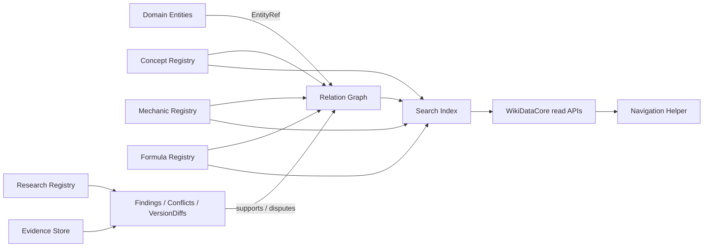

# Knowledge Domain Architecture

## 1. 目的與邊界

Knowledge Domain 是《放置天堂整合百科》的共用知識層，正式擁有 GameConcept、Mechanic、Formula 與 ResearchTopic identity，並透過 Evidence、Finding、Conflict、VersionDiff 與 Relation Graph 解釋各 Domain Entity。它不擁有 Equipment、Skill、Monster、Quest、Item、Card、Map 等主資料，也不把 Guide／Editorial 當 canonical fact。



### 1.1 不屬於本 Domain

- Domain Entity 的 canonical stats、掉落、配方、任務步驟或玩家存檔。
- DOM、畫面 rendering、URL 拼接或 localStorage 操作。
- 未經驗證的推薦搭配、職業配點與攻略結論。
- Analytics、Build Planner 或 Calculator；它們未來只能消費已驗證 Formula，不屬 K1～K5 必要範圍。

## 2. Registries 與所有權

| 元件 | 擁有內容 | 不擁有內容 |
|---|---|---|
| Concept Registry | Concept identity、分類、定義、aliases、狀態 | Equipment／Skill 主資料、主觀攻略 |
| Mechanic Registry | 可命名運作規則、條件、輸入輸出 | Interaction 結論兩端、公式 expression |
| Formula Registry | expression、variables、rounding、caps、conditions、outputs | 顯示摘要、未驗證猜測 |
| Research Registry | ResearchTopic、研究狀態與範圍 | 已驗證 canonical fields 的第二份副本 |
| Evidence Store | 可定位 Evidence records | 無來源的結論 |
| Relation Graph | typed EntityRef edges 與反向索引 | target Entity 完整內容 |
| Search Index | ID、名稱、aliases、分類、可搜尋摘要 | canonical identity 決策 |

Finding、Conflict 與 VersionDiff 是 Research records；ResearchTopic 是可獨立導航、聚合 records 的 Entity。Evidence 可被多個 Finding／Claim 引用，但不可因被引用次數而自動升級可信度。

## 3. Version Scope

每個 Concept、Mechanic、Formula、Finding、Evidence 與 Relation 都可有 VersionScope：GameVersion、sourceRevision、validFrom、validTo、introducedIn、removedIn 或 unknown。GameVersion、WikiVersion、SchemaVersion 與 source revision 依 Release 契約分離，不能互相代用。

版本未知時保持 null／unresolved；同一 ID 在不同版本有不同 canonical value 時，以版本化 records／claims 表達，不因數值改變建立新 Concept ID。真正 identity split／merge 才按 semantic diff 與 mapping 流程處理。

## 4. Verification flow

```text
Source / Observation
→ Evidence record
→ ResearchTopic / Finding
→ conflict and version review
→ claim-level verification
→ approved canonical field or Relation
→ derived summary and search index
```

1. 保存原始來源位置與 revision。
2. 建立 Official、Code、Generated、Community、Research、Test 或 Unknown Evidence。
3. Finding 明確列出支持與反駁證據、限制及版本。
4. 有衝突時建立 Conflict，不以優先級靜默覆寫。
5. 只有通過 owner Domain／Knowledge 契約審核的 claim 才寫入 canonical field。
6. summary、index 與 relation summary 由核准資料重建，可信度不得高於必要輸入。

Generated 只表示 deterministic provenance；Community 只作研究輸入；Unknown 不能顯示為 verified。

## 5. Conflict handling

Conflict 必須保存 conflictId、subjectRef、claims、evidenceRefs、version scopes、conflictType、status、currentAssessment、limitations、nextAction。允許狀態 open、reviewing、resolved、version_scoped、unresolved。

- 說明文字與 code 衝突：兩者保留，區分 display claim 與 runtime claim。
- 不同版本衝突：能證明版本邊界時轉為 VersionDiff，不刪舊 Evidence。
- 無法定位正式 subject：保持 unresolved candidate，不以名稱造 ID。
- resolved Conflict 保留 resolution、決策 Evidence 與時間範圍，不能只刪除反方資料。

## 6. Relation Graph

所有跨 Domain 關聯只保存 EntityRef／RelationRef。canonical lookup 只用 ID；搜尋 alias 命中只回候選結果，不建立 identity。Relation index 保存 edge ID／key 與 refs，不複製完整 Entity。

方向性規則：

- 非對稱關係保存 canonical from→to，反向查詢由 index 產生。
- 對稱關係以 canonical pair key 去重。
- `unresolved_relation` 保存來源 record、原始文字與候選，不提供可導航假 target。
- Interaction 可由 `mechanicRefs` 指向多個 Mechanic；Mechanic 以 `getRelatedInteractions` 反查，不保存 Interaction 完整副本。

## 7. Search Index 與 Navigation

搜尋索引包含 canonical ID、entityType、displayName、shortName、aliases、category／type、verification、dataStatus、version 與經核准摘要。排序建議為 exact ID > exact canonical name > shortName > verified alias > normalized alias > full text。

- alias、中文正規化或全文命中不等於 canonical identity。
- 搜尋結果必須帶 EntityRef、entityType、status 與命中原因。
- Concept、Mechanic、Formula、Research 可進 cross-entity search。
- Navigation 只接收 EntityRef，由 Navigation Helper 決定 URL state；Repository 不操作 DOM。

## 8. WikiDataCore 接入

未來規劃 repositories：`concepts`、`mechanics`、`formulas`、`researchTopics`、`findings`、`evidence`。它們各自註冊 Dataset、loader state、diagnostics 與 immutable indexes；一個 Dataset 失敗不得破壞其他 Domain。

### 8.1 共通 API

- `getById(id)`
- `getAll(options?)`
- `has(id)`
- `search(query, options?)`
- `getStatus(id?)`
- `getValidationErrors(id?)`

### 8.2 專用 API

Concepts：

- `getByCategory(category)`
- `getRelatedEntities(conceptId, options?)`
- `getFormulaRefs(conceptId)`
- `getMechanicRefs(conceptId)`
- `getUnresolved()`

Mechanics：

- `getByType(type)`
- `getRelatedInteractions(mechanicId)`
- `getAffectedEntities(mechanicId, options?)`

Formulas：

- `getByType(type)`
- `getVariables(formulaId)`
- `getDependents(formulaId, options?)`

Research：

- `getFindingsFor(entityRef)`
- `getConflictsFor(entityRef)`
- `getVersionDiffsFor(entityRef, options?)`

`getById` 不得依賴 mappings repository 才成立；API 回傳唯讀 view／copy，不能讓 consumer 修改 canonical store。專用 API 只聚合 refs 或 read models，不把其他 Domain Entity 複製進 Knowledge Dataset。

## 9. Diagnostics 與狀態

結構錯誤（duplicate ID、非法 enum、錯誤 EntityRef 型別）可阻止該 Dataset ready。內容未解（未知公式、缺少上限、缺 Evidence）通常形成 partial／review_required／unresolved diagnostics，不使所有 Dataset failed。

必要 diagnostics 至少涵蓋：duplicate identity、unresolved reference、missing evidence、conflicting claim、invalid version scope、formula variable unresolved、relation summary mismatch、unsafe alias collision。Dataset status 不得因能載入就宣稱 complete。

## 10. Concept 頁面資訊架構

本節只定義資訊優先序，不設計 CSS 或元件。

1. **快速答案**：它是什麼、主要影響、Verification／dataStatus、相關 Equipment／Skill 入口。
2. **詳細效果**：數值、門檻、公式、條件、單位與版本。
3. **機制解析**：程式運作、狀態判定、stack／override／consume、Interaction。
4. **研究與證據**：來源、測試、Conflict、限制與 unresolved questions。
5. **實戰應用**：職業用途、培養方向、常見誤解；明確標為 Guide／Editorial。

一般玩家預設先看到第一層，不預設展開大量程式細節。每頁先回答玩家問題，再提供 Evidence；第五層不得改寫前四層 facts。

## 11. Semantic diff 接口

Knowledge Domain 將 normalized entity diff 交給 Release review，而不是直接生成玩家文案。Concept／Formula／Mechanic 的來源版本變更可成為玩家可見遊戲變更；Wiki 校正、Research update、Editorial-only 與 Technical-only 必須分開。索引重建、JSON 排序、Markdown 排版或 alias cache 變動不產生遊戲更新。

## 12. 接入順序與隔離

1. K2 完成 source audit、stat inventory、ID mapping、Schema 與 unresolved fixtures。
2. K3 建立 deterministic generator／validator 與第一批能力 records。
3. K4 才註冊 repositories、relation indexes、search，並做 parity／immutability tests。
4. K5 以 feature flag、fallback 與 baseline tests 接入頁面。

K1 不建立任何 Dataset、Schema、Repository 或程式。Knowledge Domain 不取代 Monster／Quest／Craft 等 Domain，也不要求 Mechanics 與 Formula 一次覆蓋全遊戲。
