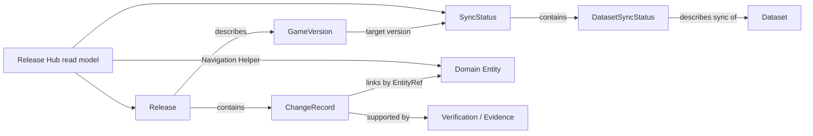

# Release Hub／版本與更新中心資料契約

## 1. 文件目的與架構邊界

Release Hub 是《放置天堂整合百科》的版本與更新入口。它讓玩家進入網站後先理解目前遊戲版本、Wiki 已同步範圍、最後同步時間、玩家可見變更、各百科模組狀態及尚待驗證內容，並可透過搜尋、快速入口與 EntityRef 前往百科內容。

本文件只定義架構、資料契約、同步流程與未來首頁資訊層級，不建立資料檔、不修改 UI，也不授權 Release Hub 直接讀寫各 Domain 主資料。

### 1.1 核心原則

- 遊戲版本與 Wiki 同步版本是兩個不同事實，必須分開顯示與驗證。
- Git diff、檔案 diff 與玩家可見更新不是同一層資料；Git diff 不得直接成為 Release 內容。
- 排序、縮排、格式化、序列化順序或換行變更不得產生玩家可見假更新。
- 所有可跳轉更新項目使用 `EntityRef`；名稱只供顯示與搜尋。
- 找不到正式 Entity ID 時保留原始資訊並標記 `unresolved`，不得虛構 ID。
- `partial`、`review_required`、`failed`、`unknown` 不得顯示為「已完成同步」。
- Release Hub 只消費發布後的 Release／Sync read model，不直接操作 Equipment、Recipe、Monster 等 Domain 資料。
- 跨模組跳轉只透過 EntityRef 與 Navigation Helper。

## 2. Entity 與責任

| Entity | 責任 | 不負責事項 |
|---|---|---|
| `GameVersion` | 描述原作者遊戲版本、來源修訂及發布時間 | Wiki 是否已同步 |
| `Release` | 描述一個已確認、可對玩家發布的 Wiki 更新批次 | 原始 Git patch 或 Domain 主資料 |
| `ChangeRecord` | 描述一項玩家可見、可驗證、可關聯 Entity 的變更 | 未經審核的 raw diff |
| `SyncStatus` | 描述整站 Wiki 對遊戲版本的同步狀態 | 自動宣稱每個 Dataset 已完整 |
| `DatasetSyncStatus` | 描述單一 Dataset／百科模組的同步、驗證與缺口 | 修改該 Dataset 的 Entity |

### 2.1 關聯



## 3. GameVersion

GameVersion 是原作者遊戲版本的正式描述，不等同 Release ID、Wiki 版本或 Schema 版本。

### 3.1 概念模型

```json
{
  "id": "game_version_verified_id",
  "version": "verified_version_label",
  "releaseDate": null,
  "sourceRevision": "verified_source_revision",
  "title": null,
  "sourceLocation": null,
  "verificationStatus": "unresolved",
  "publishedAt": null
}
```

### 3.2 規則

- `id` 必須穩定且唯一；版本標籤未知時不得自行推算。
- `version` 保存原作者可辨識的版本字串，不改寫成 Wiki 版本。
- `sourceRevision` 可是 commit、tag、release revision 或可驗證快照指紋。
- 沒有正式版本標籤但有來源修訂時，`version` 可為 null／unknown，不能把 revision 偽裝成版本。
- 同一版本可對應多次 Wiki Release；兩者不是一對一關係。

## 4. Release

Release 是經過 Entity diff、人工確認與驗證後，可供玩家閱讀的一次 Wiki 更新發布。

### 4.1 正式模型

```json
{
  "id": "release_verified_version_01",
  "version": "verified_game_version",
  "releaseDate": "2026-01-01",
  "sourceRevision": "verified_source_revision",
  "title": "版本更新摘要",
  "summary": "本次已確認並同步的玩家可見內容。",
  "changes": [
    "change_release_verified_version_equipment_verified_id_01"
  ],
  "verificationStatus": "test",
  "publishedAt": "2026-01-02T00:00:00+08:00"
}
```

### 4.2 欄位契約

| 欄位 | 必要性 | 語意 |
|---|---|---|
| `id` | 必填 | Wiki Release 的穩定唯一 ID |
| `version` | 必填或 unresolved | 目標 GameVersion；不得用 Wiki 版本替代 |
| `releaseDate` | 可空 | 遊戲版本或來源發布日期，未知時為 null |
| `sourceRevision` | 必填或 unresolved | 此次比較採用的原作者來源修訂 |
| `title` | 必填 | 玩家可理解的標題，不使用 Git commit 訊息直接代替 |
| `summary` | 必填 | 僅摘要人工確認的玩家可見變更與同步範圍 |
| `changes` | 必填 | ChangeRecord ID 陣列；順序只影響顯示，不影響 identity |
| `verificationStatus` | 必填 | `official`、`code`、`test`、`unresolved` |
| `publishedAt` | 可空 | Wiki 發布時間；未發布時為 null |

### 4.3 Release ID

```text
release_<verified-version-or-revision-key>_<variant>
```

- 不使用中文標題作為 ID。
- 同一 GameVersion 的多次 Wiki 發布使用穩定 variant。
- title、summary、排序或 publishedAt 修正不應造成 ID 重編。
- 無法驗證版本鍵時，不得自行創造看似正式的版本 ID；應先保留 unresolved 發布候選。

## 5. ChangeRecord

ChangeRecord 是已從 raw diff 提升為 Entity 層、經人工判斷為玩家可見且可驗證的單項變更。

### 5.1 正式模型

```json
{
  "id": "change_release_verified_version_equipment_verified_id_01",
  "releaseId": "release_verified_version_01",
  "changeType": "changed",
  "entityRef": {
    "entityType": "equipment",
    "entityId": "verified_equipment_id"
  },
  "title": "裝備效果調整",
  "summary": "已確認的玩家可見效果有所調整。",
  "details": {
    "fields": [],
    "before": null,
    "after": null,
    "impact": null
  },
  "sourceLocation": null,
  "verificationStatus": "code",
  "dataStatus": "complete"
}
```

### 5.2 欄位契約

| 欄位 | 必要性 | 語意 |
|---|---|---|
| `id` | 必填 | 穩定 ChangeRecord ID |
| `releaseId` | 必填 | 所屬 Release ID |
| `changeType` | 必填 | 第 6 節列舉值 |
| `entityRef` | 必填或 unresolved | 玩家可跳轉 EntityRef；無正式 ID 時不得用名稱冒充 |
| `title` | 必填 | 玩家可理解的單項變更標題 |
| `summary` | 必填 | 不超出 Evidence 的中性摘要 |
| `details` | 必填 | 結構化 before／after、欄位、影響與條件；未知值明確保留 |
| `sourceLocation` | 必填或 unresolved | 可定位來源、比較結果或研究證據 |
| `verificationStatus` | 必填 | `official`、`code`、`test`、`unresolved` |
| `dataStatus` | 必填 | `complete`、`partial`、`stub`、`unresolved` |

### 5.3 ChangeRecord ID

```text
change_<releaseId>_<entityType>_<entityId>_<variant>
```

- 只使用正式 ID，不使用中文名稱。
- 同一 Entity 在同一 Release 可有多筆不同語意的 ChangeRecord，以穩定 variant 區分。
- 不因顯示排序、文案修改或 `changeType` 校正而重編。
- 找不到正式 Entity ID 時，保留 unresolved candidate，不建立虛構正式 ChangeRecord ID。

## 6. changeType

| 值 | 語意 |
|---|---|
| `added` | 新增玩家可使用、遇到或查詢的 Entity／能力 |
| `changed` | 一般內容或行為改變，且不屬於更精確類型 |
| `balanced` | 數值、成本、機率、冷卻或強度的平衡調整 |
| `fixed` | 修復原遊戲程式或資料的錯誤行為 |
| `removed` | Entity、能力、來源或功能被移除 |
| `renamed` | canonical 顯示名稱改變，Entity identity 未必改變 |
| `mechanic_changed` | 公式、觸發、優先序、Buff／Debuff 或戰鬥規則改變 |
| `data_corrected` | Wiki 先前資料被校正，不代表原遊戲本次改動 |
| `unresolved` | 已發現差異，但玩家意義、Entity 或證據尚未確認 |

### 6.1 分類規則

- `fixed` 描述遊戲端修正；Wiki 自身內容錯誤改正使用 `data_corrected`。
- 純名稱變更用 `renamed`，但必須驗證是否仍是同一 Entity。
- 數值變動優先用 `balanced`；底層判定路徑改變用 `mechanic_changed`。
- 一項變更若同時影響多個 Entity，應依玩家可導航與驗證單位拆分，必要時以 Release summary 聚合。
- raw diff 無法確認玩家意義時用 `unresolved`，不得為了統計卡片強行分類。

## 7. SyncStatus

SyncStatus 是首頁版本 Hero 與整體同步狀態的權威 read model。它分開呈現遊戲版本、Wiki 版本及 Schema 版本。

### 7.1 正式模型

```json
{
  "gameVersion": "verified_game_version",
  "wikiVersion": "verified_wiki_release_or_revision",
  "schemaVersion": "verified_schema_version",
  "status": "partial",
  "lastSyncAt": "2026-01-02T00:00:00+08:00",
  "datasetStatuses": [
    {
      "dataset": "equipment",
      "status": "up_to_date",
      "gameVersion": "verified_game_version",
      "wikiVersion": "verified_wiki_revision",
      "lastSyncAt": "2026-01-02T00:00:00+08:00",
      "unresolvedCount": 0,
      "verificationStatus": "test",
      "notes": []
    }
  ],
  "unresolvedCount": 3,
  "notes": []
}
```

### 7.2 欄位契約

| 欄位 | 必要性 | 語意 |
|---|---|---|
| `gameVersion` | 必填或 unknown | 當前比較目標的原作者遊戲版本 |
| `wikiVersion` | 必填 | Wiki 已發布資料快照／Release 版本 |
| `schemaVersion` | 必填 | 驗證此 read model 的資料契約版本 |
| `status` | 必填 | 第 8 節同步狀態 |
| `lastSyncAt` | 可空 | 最近一次完成可驗證同步步驟的時間，不是頁面建置時間 |
| `datasetStatuses` | 必填 | DatasetSyncStatus 陣列 |
| `unresolvedCount` | 必填 | 整站未解更新／同步問題數；計算規則必須固定 |
| `notes` | 必填 | 非結構化補充；不得取代 dataset status 或 unresolved 清單 |

## 8. DatasetSyncStatus 與同步狀態

### 8.1 DatasetSyncStatus

每個 Dataset／百科模組有獨立同步狀態，至少包含：

- `dataset`
- `status`
- `gameVersion`
- `wikiVersion`
- `lastSyncAt`
- `unresolvedCount`
- `verificationStatus`
- `notes`

可選欄位包括 `sourceRevision`、`entityCounts`、`changedEntityCount`、`validationErrorCount`、`blockingIssues`。這些是同步摘要，不是 Domain Entity 的副本。

### 8.2 status

| 值 | 精確語意 | 首頁可否顯示完成 |
|---|---|---|
| `up_to_date` | 已針對目標 GameVersion 完成生成、Entity diff、人工確認與驗證 | 可以 |
| `syncing` | 同步流程進行中，尚未形成可發布結果 | 不可以 |
| `partial` | 只有部分 Dataset、Entity 或欄位同步完成 | 不可以 |
| `review_required` | 自動流程完成，但玩家可見變更或 unresolved 尚待人工確認 | 不可以 |
| `failed` | 生成、比較、驗證或發布閘門失敗 | 不可以 |
| `unknown` | 無法確定來源版本、同步範圍或狀態 | 不可以 |

### 8.3 整站狀態聚合

- 只有所有必要 Dataset 都是 `up_to_date`，且無 blocking issue，整站才可為 `up_to_date`。
- 任一必要 Dataset 為 `failed`，整站不得優於 `failed`。
- 有 Dataset 為 `review_required`，整站至少為 `review_required`。
- 有 Dataset 為 `partial` 或缺少必要 Dataset，整站為 `partial`。
- `syncing` 只表示流程進行中，不得保留上一版「已完成同步」文案。
- 聚合優先序與必要 Dataset 清單必須由契約定義，不能由 UI 猜測。

## 9. 未來資料檔規劃

### 9.1 `data/releases/releases.json`

- 保存已發布 Release 與 ChangeRecord，或以明確 reference 組織兩者。
- 是歷史版本入口與更新列表的權威 read model。
- 不保存 raw Git diff、完整 Domain Entity 或未審核自動摘要。

### 9.2 `data/releases/latest.json`

- 保存首頁需要的最新已發布 Release 投影。
- 內容必須可追溯至 `releases.json` 的正式 Release／ChangeRecord ID。
- 不得因生成時間不同而產生語意 diff。

### 9.3 `data/releases/sync-status.json`

- 保存 SyncStatus 與 DatasetSyncStatus。
- 清楚區分 gameVersion、wikiVersion、schemaVersion。
- 任何 partial／failed／unknown 狀態必須原樣提供 UI，不可在資料層美化為完成。

### 9.4 資料所有權

- Releases Dataset 擁有 Release、ChangeRecord、SyncStatus、DatasetSyncStatus。
- GameVersion 可由 System Domain 擁有，Releases Dataset 以 ID／版本引用。
- Equipment、Recipe、Monster、NPC 等 Domain 仍擁有自身 Entity。
- Release Hub 不把 ChangeRecord 內的摘要回寫到 Domain 主資料。

## 10. 更新同步流程

```text
原作者程式碼／資料
  → source snapshot
  → generators
  → normalized dataset snapshots
  → raw diff
  → semantic entity diff
  → human review
  → Release + ChangeRecord
  → validators / quality gates
  → published Release Hub read models
```

### Step 1：同步原作者程式碼

- 記錄來源 URL／管道、revision、tag、取得時間與版本指紋。
- 保留前一個已發布來源快照作為比較基準。
- 同步成功不代表 Wiki 已完成同步。

### Step 2：執行資料生成器

- 使用可重現的輸入、工具版本與生成規則。
- 生成失敗時狀態為 `failed`，不得沿用舊完成標籤。
- 本流程不允許生成器直接撰寫玩家更新文案。

### Step 3：與上一版資料比較

- 比較正規化後的 Dataset snapshot，而非只比較來源檔案文字。
- 基準必須是上一個已驗證／已發布 Wiki snapshot，並記錄其版本。

### Step 4：產生 raw diff

- raw diff 用於工程追蹤，包含新增、刪除、欄位變動與來源位置。
- 它可能包含格式、排序或衍生欄位變化，不可直接發布給玩家。

### Step 5：產生 entity diff

- 依 Entity type + stable ID 比較語意欄位。
- 忽略物件 key 順序、陣列中定義為無序的項目順序、空白、格式化及可重算衍生值。
- 對有序陣列必須由 Domain 契約判定順序是否具遊戲語意。
- 找不到正式 Entity ID 時建立 unresolved candidate，不以名稱合併。

### Step 6：人工確認玩家可見變更

- 判斷差異是否影響玩家、應使用哪個 changeType、摘要是否超出 Evidence。
- 分開「遊戲本身改變」與「Wiki data_corrected」。
- 合併純技術差異，拆分跨 Entity 且可獨立導航的更新。

### Step 7：生成 Release 與 ChangeRecord

- 只根據已審核 entity diff 生成。
- 每筆可跳轉變更必須有 EntityRef；無 ID 者保持 unresolved。
- Release summary 只統計正式納入的 ChangeRecord。

### Step 8：執行驗證器

- 驗證 ID、releaseId、EntityRef、changeType、版本、日期、Evidence 及狀態聚合。
- 檢查假更新、重複 ChangeRecord、已移除 Entity 的 navigation、partial 誤標完成。
- blocking diagnostic 阻止發布。

### Step 9：發布首頁更新

- 產生 latest 與 sync-status read model。
- 發布後驗證首頁、搜尋、Navigation Helper、Console、Network、404 與 baseline。
- 發布只讀取已驗證 read model，不在瀏覽器執行 diff 或直接掃描 Domain 資料。

## 11. Diff 正規化與假更新防護

### 11.1 必須忽略

- JSON object key 排序。
- 空白、縮排、換行及檔案結尾差異。
- 明確定義為 set 的陣列排序。
- 可由相同來源重新計算且值未改變的 derived fields。
- 生成器輸出時間、暫存路徑及非語意 metadata。

### 11.2 不可一律忽略

- Recipe requirements、Quest steps、Combat priority 等契約定義為有序的陣列。
- Entity ID、EntityRef、版本範圍與 verification status。
- null、missing、unknown、unresolved 之間的狀態改變。
- 數值單位、取整、上限及公式順序。

### 11.3 品質檢查

- raw diff 有變更但 entity diff 為零：記錄為 technical-only，不發布 ChangeRecord。
- entity diff 有變更但無 EntityRef：標 unresolved 並進人工 review。
- entity diff 與上一版相同：不得因重新生成建立新 Release change。
- renamed 必須確認 identity 未變；無法確認時不可自動連結舊、新名稱。

## 12. 首頁資訊架構

### 12.1 版本 Hero 區

首屏提供：

- 遊戲目前版本。
- Wiki 已同步版本。
- 整站 sync status。
- 最後同步時間。
- 本次 Release title／summary。
- partial、review_required、failed、unknown 的明確警示。

### 12.2 本次更新統計卡片

- added、changed、balanced、fixed、removed 等 ChangeRecord 數量。
- unresolved／待確認數量必須獨立顯示。
- 統計只計正式 ChangeRecord，不計 raw diff 行數或檔案數。

### 12.3 更新分類列表

- 依 changeType 與 Domain 分組。
- 每筆顯示 title、summary、驗證狀態、版本及可解析 EntityRef。
- unresolved 項目不可製造假跳轉。

### 12.4 各模組同步狀態

- Equipment、Skill、Monster、Recipe、NPC、Quest、Card、System、Mechanics、Research 等 Dataset 狀態。
- 顯示 lastSyncAt、unresolvedCount、驗證或阻擋摘要。
- partial 不得顯示勾選完成圖示或「已同步」文案。

### 12.5 尚待驗證內容

- unresolved ChangeRecord、來源版本問題、缺少 EntityRef、Evidence 衝突。
- 顯示原因與影響範圍，不暴露不必要的工程 raw diff。

### 12.6 全站搜尋

- 使用 WikiDataCore cross-Entity search。
- 搜尋 Release／ChangeRecord 與各 Domain Entity，但結果保持 owner repository 邊界。
- 更新命中項可先開啟 Release 詳情，再以 EntityRef 跳轉百科。

### 12.7 快速百科入口

- 以固定 Domain／Navigation mapping 提供 Equipment、Recipe、Monster、Card 等入口。
- 不從 ChangeRecord 動態推測頁面 URL。

### 12.8 歷史版本入口

- 依 publishedAt／GameVersion 提供 Release 歷史。
- 可查看當時 Wiki sync status 與 ChangeRecord，不以最新狀態覆蓋歷史事實。

## 13. 桌面與手機資訊優先順序

本節只定義內容層級，不設計 CSS。

### 13.1 桌面

1. 版本 Hero：gameVersion、wikiVersion、status、lastSyncAt。
2. Release summary 與更新統計。
3. 更新分類列表及 Dataset 同步狀態並列或相鄰。
4. 尚待驗證內容。
5. 全站搜尋與快速百科入口。
6. 歷史版本入口。

桌面可同時呈現全站與 Dataset 摘要，但不得讓大量統計壓過同步狀態警示。

### 13.2 手機

1. 同步狀態與遊戲／Wiki 版本差異。
2. 最後同步時間與 Release summary。
3. 全站搜尋。
4. 快速百科入口。
5. 本次更新統計與分類列表。
6. Dataset 同步狀態。
7. 尚待驗證內容。
8. 歷史版本入口。

手機首屏優先回答「目前資料是否已同步」，統計卡片可折疊或延後，但 failed／partial／review_required 警示不可隱藏。

## 14. WikiDataCore 接入規劃

### 14.1 Dataset 與 repositories

未來註冊 `releases` Dataset，規劃 repositories：

- `gameVersions`
- `releases`
- `changeRecords`
- `syncStatus`（singleton read repository）
- `datasetSyncStatuses`

Release Hub 不取得其他 Domain repository 的 entity object 來重建資料；它只解析 EntityRef、呼叫 cross-search 與 Navigation Helper。

### 14.2 專用查詢

`releases`：

- `getLatest()`
- `getByGameVersion(version)`
- `getPublished()`

`changeRecords`：

- `getByReleaseId(releaseId)`
- `getByEntity(entityRef)`
- `getByType(changeType)`
- `getUnresolved()`

`datasetSyncStatuses`：

- `getByDataset(name)`
- `getByStatus(status)`
- `getIncomplete()`

### 14.3 索引

- `releasesById`
- `releasesByGameVersion`
- `changesById`
- `changesByReleaseId`
- `changesByEntityKey`
- `changesByType`
- `datasetStatusByName`
- `datasetStatusesByStatus`

索引保存 ID／不可變引用，不複製 Domain Entity。EntityRef 無法解析時保留 ChangeRecord 並產生 unresolved diagnostic，不阻止 Release Hub 顯示「尚待驗證」，但 blocking contract error 必須阻止發布。

### 14.4 Navigation 與 Search

- ChangeRecord 點擊：`entityRef → Navigation Helper → canonical URL state`。
- Release Hub 不組裝各 Domain URL，不操作 DOM，不修改 Domain data。
- Cross-search 聚合 Release 與 Domain 結果；結果必須標示 entityType、verification 與版本。
- `removed` Entity 若無可導航頁面，應導向歷史／tombstone view 或保持不可跳轉，不連到錯誤的新 Entity。

### 14.5 載入與 fallback

- Release Hub read models 可獨立載入；失敗不應破壞其他百科 Dataset。
- latest 缺失時可顯示歷史 Release，但必須標示狀態，不得假稱最新。
- sync-status 缺失時顯示 `unknown`，不能以 Release version 推算 `up_to_date`。
- 首頁 consumer 接入前須有 feature flag、fixture、validation、fallback、Console／Network／baseline 測試。

## 15. 驗證與發布閘門

### 15.1 結構驗證

- Release、ChangeRecord ID 唯一。
- releaseId、changes、EntityRef 及 GameVersion reference 可解析或明確 unresolved。
- 日期與時間格式有效，publishedAt 不早於資料可用時間。
- changeType、sync status、verificationStatus、dataStatus 為允許值。

### 15.2 語意驗證

- Git diff 未直接成為 ChangeRecord。
- technical-only diff 不出現在玩家統計。
- 遊戲版本、Wiki 版本、Schema 版本沒有互相代用。
- partial／review_required／failed／unknown 沒有完成文案。
- ChangeRecord 摘要不超出 sourceLocation／Evidence。
- `data_corrected` 與遊戲端 `fixed` 沒有混淆。
- removed／renamed 的 EntityRef 與 Navigation 行為經過審核。

### 15.3 發布驗收

- `releases.json`、`latest.json`、`sync-status.json` 相互一致。
- latest 指向已發布 Release，統計等於該 Release 的 ChangeRecord。
- 全站 status 符合 Dataset 狀態聚合規則。
- Search、快速入口、Entity 跳轉及歷史版本可用。
- Console 無 Error、Network 無 404、既有百科 baseline 無回歸。

## 16. Roadmap

### Stage A：版本來源與比較契約

- 盤點原作者版本標籤、revision、快照及現行 Wiki 版本來源。
- 定義 GameVersion、Wiki version、Schema version identity。
- 定義 Dataset 必要清單與狀態聚合優先序。

### Stage B：Semantic diff 設計

- 為各 Domain 定義有序／無序欄位、derived fields 與玩家可見欄位。
- 建立 raw diff → entity diff 的正規化與假更新測試案例。
- 定義 unresolved candidate 與人工 review 流程。

### Stage C：資料、Schema、生成與驗證

- 經另行核准後建立三個 release 資料檔、Schema、generator 與 validator。
- 建立上一版 fixture、deterministic output 與發布閘門。

### Stage D：WikiDataCore 接入

- 註冊 Releases Dataset、repositories、indexes、search 與 Navigation Helper 整合。
- 以 feature flag、fallback、parity 與 isolation 測試接入。

### Stage E：第一個玩家可見首頁功能

- 先交付版本 Hero、同步狀態、Release summary、全站搜尋與快速入口。
- 再加入更新分類、Dataset 狀態、unresolved 與歷史版本。
- 手機優先顯示同步可信度，桌面提供更完整並列摘要。

## 17. Stage B 定案引用

Release Hub 的來源、版本與差異判定應遵循：

- `docs/RELEASE_SOURCE_MANIFEST_CONTRACT.md`：full source SHA、retrieval、檔案 hash 與 immutable source identity。
- `docs/RELEASE_VERSIONING_CONTRACT.md`：GameVersion、WikiVersion、SchemaVersion 與 source revision 分離。
- `docs/SEMANTIC_DIFF_POLICY.md`：raw diff、normalized diff、entity diff 與 reviewed ChangeRecord 邊界。

第一個 Release 定義為 bootstrap baseline，不以現有全部 Entity 生成 `added` ChangeRecord。GameVersion 候選為 `v3.2.79`，source revision 候選為 `9252a99c152bca1256a900c94335cadff52558e9`；只有 Source Manifest、hash、Dataset status 與發布閘門完成後才能正式使用。

WikiVersion 採獨立 `wiki-vMAJOR.MINOR.PATCH`，第一個正式發布候選為 `wiki-v1.0.0`。SchemaVersion 採 global envelope 與 per-Dataset 雙層版本。以上候選不是本階段已發布的版本或資料。

P0 Dataset 為 Equipment、Skill、Craft、Monster、Card；P1 為 Quest、NPC、Region、System；P2 為 Mechanics、Research、Interactions。Dataset status 不得繼承整站或其他 Dataset，沒有 generator／validator／source linkage 的 Dataset 不得標為 `up_to_date`。

## 18. 明確不做的事項

- 本階段不新增 HTML、CSS、JavaScript、JSON、Schema 或生成器。
- 不直接把 Git commit、diff 行數或檔案列表顯示給玩家。
- 不由 Release Hub 修改、修補或複製各 Domain 主資料。
- 不以名稱比對代替 EntityRef。
- 不自動生成無 Evidence 的玩家更新文案。
- 不因來源抓取成功就宣稱 Wiki 已同步完成。
- 不在 partial 或 unknown 狀態下隱藏警示。
